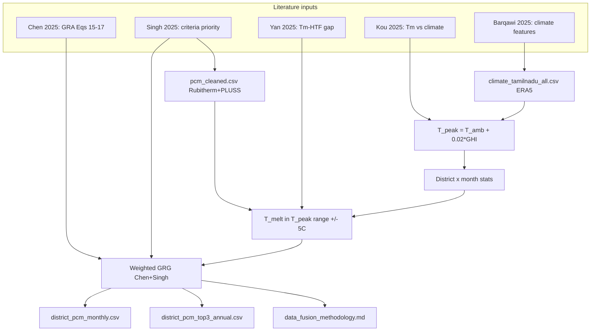

# Climate–PCM Data Fusion with GRG (Detailed Literature Traceability)

## 1. Literature Traceability Matrix

Every design decision in this pipeline maps to one of four origin types:

| Origin type | Meaning |
|-------------|---------|
| **Paper (direct)** | Equation, criterion, or numeric value taken verbatim or with unit conversion from a cited study |
| **Paper (adapted)** | Concept from a paper applied to a new variable, scale, or geography |
| **Project spec** | Explicit instruction in [`datafusion.txt`](f:\Final Year Project\datafusion.txt) or [`PROJECT SUMMARY.md`](f:\Final Year Project\PCM-Selection-ML-model\PROJECT SUMMARY.md) |
| **Engineering choice** | Reasonable implementation detail not specified in any paper (documented for reproducibility) |

### Master mapping: what comes from which paper

| Pipeline element | Origin | Source | Exact reference |
|------------------|--------|--------|-----------------|
| **Use GRA/GRG for multi-criteria PCM ranking** | Paper (direct) | **Chen et al. (2025)** | GRA procedure §4d; Eq. **(15)–(17)**; ζ = **0.5** in Eq. **(16)**. Summary: [`Sources/Chen2025TaguchiGRA_PCM_Nanofluid_SWH_summary.md`](f:\Final Year Project\PCM-Selection-ML-model\Sources\Chen2025TaguchiGRA_PCM_Nanofluid_SWH_summary.md) |
| **GRG formula** ξᵢ = (Δ_min + ζ·Δ_max) / (Δᵢ + ζ·Δ_max) | Paper (direct) | **Chen et al. (2025)** | Eq. **(16)**; also stated in [`PROJECT SUMMARY.md`](f:\Final Year Project\PCM-Selection-ML-model\PROJECT SUMMARY.md) §Technical Knowledge |
| **Weighted GRG** γᵢ = Σ w(k)·ξᵢ(k) | Paper (direct) | **Chen et al. (2025)** | Eq. **(17)**; Chen averages over *responses* (efficiency + retention); we average over *PCM criteria* with Singh-derived weights |
| **Distinguishing coefficient ζ = 0.5** | Paper (direct) | **Chen et al. (2025)** | Eq. **(16)**; standard GRA value used in Chen's Taguchi DOE |
| **Larger-the-better normalization** x* = (x − min)/(max − min) | Paper (direct) | **Chen et al. (2025)** | Eq. **(15)** — applied before computing Δᵢ |
| **GRG criterion: latent heat (w=0.35)** | Paper (adapted) | **Singh et al. (2025)** | §5a selection priority **#1** = latent heat (highest). Weight 0.35 assigned in [`datafusion.txt`](f:\Final Year Project\datafusion.txt); proportional to Singh's stated priority order |
| **GRG criterion: thermal conductivity (w=0.25)** | Paper (adapted) | **Singh et al. (2025)** | §5a priority **#2** = thermal conductivity. Weight 0.25 from project spec |
| **GRG criterion: T_melt_match (w=0.25)** | Paper (adapted) | **Kou et al. (2025)** + **Yan et al. (2025)** + **Singh et al. (2025)** | Kou: optimal T_m ≈ **T_L + 2 °C** (§4c, Table in §5); Yan: PCM T_m should be **5–10 °C below HTF** (§5); Singh: priority **#3** = melting point. `T_melt_match = 100 − \|T_melt − T_peak_mean\|` is an engineering proxy for "closeness to climate-optimal melt point" |
| **GRG criterion: specific heat (w=0.15)** | Paper (adapted) | **Singh et al. (2025)** | §5a priority **#4** = specific heat capacity. Weight 0.15 from project spec |
| **Density excluded from GRG** | Paper (adapted) | **Singh et al. (2025)** | §5a priority **#5** = density (lowest). Not in GRG weights per [`datafusion.txt`](f:\Final Year Project\datafusion.txt) |
| **SWH PCM band 40–70 °C** | Paper (direct) | **Singh et al. (2025)** | §5c: "Solid–liquid organic PCM phase-change temperature: **40–70 °C**" [Table 5, ref. 178] |
| **Pre-filter 35–75 °C (before climate filter)** | Paper (adapted) | **Singh et al. (2025)** | Already in [`PCM_data/03_process_pcm.py`](f:\Final Year Project\PCM-Selection-ML-model\PCM_data\03_process_pcm.py): Singh 40–70 °C with ±5 °C margin |
| **PCM candidate list (RT + PLUSS OM/savE)** | Project spec | **PROJECT SUMMARY.md** §Data Collection | Lists RT35–RT64HC, HS36, OM35–OM50. Property values from manufacturer datasheets; **Martínez et al. (2025)** validates Rubitherm datasheet uncertainty (RT54HC ΔH −5%, k +15%) |
| **T_peak = T_amb + 0.02 × GHI** | Project spec | [`datafusion.txt`](f:\Final Year Project\datafusion.txt) Step 1 | Conceptually supported by **Barqawi (2025)** Eq. **(3)**: T_c = T_amb + (η·I_solar)/20 — solar-heated surface temperature rises with irradiance above ambient. **Assareh (2023)** Eq. **(1)**: Q_u = A_c·F_R·[S − U(T_c − T_a)] links GHI (as S) to collector temperature rise |
| **Daily max then monthly mean T_peak** | Project spec + Paper (adapted) | [`datafusion.txt`](f:\Final Year Project\datafusion.txt) | **Ghodusinejad et al. (2026)**: GHI is primary solar driver across forecast horizons. **Kou (2025)**: climate indices computed from seasonal/daily solar and temperature aggregates |
| **±5 °C PCM filter on T_peak range** | Project spec + Paper (adapted) | [`datafusion.txt`](f:\Final Year Project\datafusion.txt) Step 2; user confirmed `[T_peak_min−5, T_peak_max+5]` | **Yan (2025)**: PCM T_m **5–10 °C below HTF** justifies ±5 °C tolerance band. **Kou (2025)**: fixed phase-change range **ΔT = 2 °C** (§5) — our ±5 °C band is wider to cover daily/monthly climate swing |
| **Climate variables: GHI, T_amb, DNI, wind, RH** | Paper (direct) | **Barqawi (2025)** | 8-input ML vector: GHI, DNI, DHI, T_amb, W_spd, RH, Hour, Month — [`04_fuse_data.py`](f:\Final Year Project\PCM-Selection-ML-model\PCM_data\04_fuse_data.py) header cites this |
| **Climate variables (extended set)** | Paper (adapted) | **Liu et al. (2025)** AI–PCM review | 8-feature weather vector pattern: GHI, DNI, DHI, T_a, wind, RH, hour, month |
| **ERA5 as climate backbone** | Project spec | **PROJECT SUMMARY.md** §Data Collection | "ERA5 (ECMWF/Copernicus): hourly reanalysis backbone." Implemented in [`era5-tamilnadu-pipeline/`](f:\Final Year Project\PCM-Selection-ML-model\era5-tamilnadu-pipeline\). **Ghodusinejad (2026)**: reanalysis/NWP as input class for solar forecasting |
| **NASA POWER** | Project spec (not implemented) | **PROJECT SUMMARY.md** §Data Collection | Listed for cross-validation; no download script exists yet |
| **RRTDHS index** (computed in climate CSV, not used in GRG step) | Paper (direct) | **Kou et al. (2025)** | Eq. **(18)**: RRTD_HS = Q_sol,ave / (T_set − T_out,ave). Used in existing pipeline [`README.md`](f:\Final Year Project\PCM-Selection-ML-model\README.md) and [`04_fuse_data.py`](f:\Final Year Project\PCM-Selection-ML-model\PCM_data\04_fuse_data.py) |
| **RRTDHS > 5.7 → Tm ≈ T_set + 2 °C** (legacy label map, not GRG) | Paper (adapted) | **Kou et al. (2025)** | [`03_process_pcm.py`](f:\Final Year Project\PCM-Selection-ML-model\PCM_data\03_process_pcm.py) comment; Kou Table 3 zones: RRTD ≥ 8.5 / 6.0–8.5 / < 6.0. Threshold 5.7 is an engineering interpolation |
| **ρH = density × latent heat** (TOPSIS only, not GRG) | Paper (direct) | **Kou et al. (2025)** | §5: volumetric enthalpy ρH search range 0–420 MJ/m³; optimum always at upper bound. Used in `03_process_pcm.py` TOPSIS, not in this GRG pipeline |
| **TOPSIS vs GRG** | Paper (direct) | **Chen (2025)** = GRG; **Singh (2025)** = criteria | `03_process_pcm.py` uses TOPSIS (different weights: 0.40/0.25/0.10/0.15/0.10). **This pipeline uses GRG per PROJECT SUMMARY Objective 1** |
| **PCM property columns (Tm, L, k, Cp, ρ)** | Paper (direct) | **Singh et al. (2025)** Table 1–2 | Desirable PCM properties table. Values from Rubitherm/PLUSS datasheets; **Martínez et al. (2025)** warns measured ΔH can differ up to 91% from datasheets |
| **T_set = 45 °C** (in climate CSV) | Engineering choice | [`era5-tamilnadu-pipeline`](f:\Final Year Project\PCM-Selection-ML-model\era5-tamilnadu-pipeline\Readme.md) | Reference temperature for RRTDHS; aligns with **Singh (2025)** SWH operating context and **Chen (2025)** 30 °C retention target (different metric) |
| **District × month aggregation** | Engineering choice | Tamil Nadu FYP scope | No paper specifies TN district-level PCM ranking; **Kou (2025)** optimizes per-city (61 Chinese cities); we scale to 38 TN districts |
| **Mean of per-location daily T_peak max** | Engineering choice | — | 222 ERA5 grid points per district; mean avoids single-point outlier. Not from a specific paper |
| **Annual top-3 by mean GRG** | Engineering choice | Extends **Chen (2025)** single-winner GRG | User confirmed: both monthly best_PCM table + annual top-3 summary |
| **DRL state vector [T_w, T_p, f, GHI, T_amb, wind, time]** | Paper (direct) | **PROJECT SUMMARY.md** | Objective 2; **Emami (2026)** DRL for solar-TES; **Odoi-Yorke (2025)** demand/climate features — downstream of this fusion step |

---

## 2. Current State

| Asset | Location | Status |
|-------|----------|--------|
| TN climate (hourly, ~3.9M rows, 38 districts) | [`era5-tamilnadu-pipeline/data/processed/climate_tamilnadu_all.csv`](f:\Final Year Project\PCM-Selection-ML-model\era5-tamilnadu-pipeline\data\processed\climate_tamilnadu_all.csv) | Ready — ERA5 per **PROJECT SUMMARY** |
| PCM catalog (18 candidates) | [`PCM_data/pcm_cleaned.csv`](f:\Final Year Project\PCM-Selection-ML-model\PCM_data\pcm_cleaned.csv) | Ready — filtered per **Singh (2025)** 35–75 °C |
| GRG theory | [`Sources/Chen2025TaguchiGRA_PCM_Nanofluid_SWH_summary.md`](f:\Final Year Project\PCM-Selection-ML-model\Sources\Chen2025TaguchiGRA_PCM_Nanofluid_SWH_summary.md) | Documented, not coded |
| Literature digests | [`Sources/*_summary.md`](f:\Final Year Project\PCM-Selection-ML-model\Sources) (22 files) + [`Sources/extracted_papers/`](f:\Final Year Project\PCM-Selection-ML-model\Sources\extracted_papers) (18 OCR texts) | Read during methodology doc; cross-link in code comments |
| TOPSIS prototype | [`PCM_data/03_process_pcm.py`](f:\Final Year Project\PCM-Selection-ML-model\PCM_data\03_process_pcm.py) | Different method (**not GRG**) |

---

## 3. Architecture



---

## 4. Step-by-Step Implementation (with paper citations)

### Step 0 — Read Sources (documentation pass)

Before coding, synthesize from **all** files in [`Sources/`](f:\Final Year Project\PCM-Selection-ML-model\Sources):

| Paper | Relevance to this pipeline | Key file |
|-------|----------------------------|----------|
| **Chen et al. (2025)** | **Primary:** GRA/GRG equations, ζ=0.5, RT35HC PCM reference | `Chen2025TaguchiGRA_PCM_Nanofluid_SWH_summary.md`, `_extracted_chen_taguchi.txt` |
| **Singh et al. (2025)** | **Primary:** PCM selection priority, 40–70 °C band, SWH integration | `Singh2025PCM_SWH_ComprehensiveReview_summary.md`, `_extracted_singh_pcm.txt` |
| **Kou et al. (2025)** | **Primary:** RRTDHS climate index, T_m vs T_demand, ρH | `Kou2025BIHP_PCM_Building_Optimization_summary.md`, `_extracted_kou.txt` |
| **Yan et al. (2025)** | **Secondary:** T_m–HTF temperature gap (±5 °C justification) | `Yan2025ML_MeltingTime_TriplexTube_PCM_summary.md` |
| **Barqawi (2025)** | **Secondary:** Climate feature vector for ML fusion | `Barqawi2025DynamicSimulationPCM_SWH_summary.md`, `_extracted_barqawi_ocr.txt` |
| **Assareh (2023)** | **Secondary:** Q_u collector equation linking GHI to useful heat | `Assareh2023EnhancingSolarThermalPCM_summary.md` |
| **Martínez et al. (2025)** | **Secondary:** Rubitherm property validation uncertainty | `Martinez2025PCM_Industrial_TES_summary.md` |
| **Liu et al. (2025)** | **Secondary:** AI weather feature vector for PCM-TES | `Liu2025AI_PCM_TES_Prediction_Optimization_summary.md` |
| **Ghodusinejad et al. (2026)** | **Secondary:** GHI as primary solar input; ERA5/reanalysis class | `Ghodusinejad2026SolarIrradianceForecasting_summary.md` |
| **Odoi-Yorke (2025)** | **Tertiary:** AI-SWH review; GRA cluster cross-cite | `OdoiYorke2025AI_SWH_Review_summary.md` |
| **Hamzat (2025)** | **Tertiary:** Q = mL + mCpΔT enthalpy balance for grey-box | `Hamzat2025PCM_SolarEnergyStorage_summary.md` |
| **Abdellatif (2025)** | **Tertiary:** Enthalpy method H(T) for PCM simulation | `Abdellatif2025PCM_Modeling_Review_summary.md` |
| **Eldokaishi (2022)** | **Tertiary:** ANN SWH; T_p = 25–35 °C design sweep | `Eldokaishi2022WaterPCM_ANN_SWH_summary.md` |
| **Emami (2026), Terfai (2025), Barghi (2026)** | **Not used in fusion** — cited in methodology as downstream DRL/control context | respective summaries |

Output: [`PCM_data/docs/data_fusion_methodology.md`](f:\Final Year Project\PCM-Selection-ML-model\PCM_data\docs\data_fusion_methodology.md) with IEEE citations for every equation.

---

### Step 1 — Load inputs

**Script:** [`PCM_data/05_grg_climate_fusion.py`](f:\Final Year Project\PCM-Selection-ML-model\PCM_data\05_grg_climate_fusion.py)

| Input | Path | Paper / spec justification |
|-------|------|------------------------------|
| Climate CSV | `../era5-tamilnadu-pipeline/data/processed/climate_tamilnadu_all.csv` | **PROJECT SUMMARY:** ERA5 hourly backbone. **Ghodusinejad (2026):** reanalysis-grade irradiance |
| PCM CSV | `pcm_cleaned.csv` | **Singh (2025)** SWH-suitable PCMs; **Martínez (2025)** Rubitherm validation context |

**Column mapping (PCM side):**

| `datafusion.txt` name | `pcm_cleaned.csv` column | Paper basis |
|-----------------------|--------------------------|-------------|
| `PCM_name` | `product` | Manufacturer datasheet (**Martínez 2025** screening method) |
| `T_melt` | `Tm_melting` | **Singh (2025)** Table 2 — primary selection criterion #3 |
| `latent_heat` | `latent_heat_melting` | **Singh (2025)** criterion #1 |
| `thermal_conductivity` | `TC_both` | **Singh (2025)** criterion #2; **Barqawi (2025)** notes k = 0.1–0.5 W/m·K typical |
| `specific_heat` | `Cp_avg` | **Singh (2025)** criterion #4 |
| `density` | `density_solid` | **Singh (2025)** criterion #5 — stored but **not in GRG** |

**Column mapping (climate side):**

| Variable | ERA5 column | Paper basis |
|----------|-------------|-------------|
| `T_amb` | `T_amb` | **Barqawi (2025)** input; **Kou (2025)** T_out,ave in RRTDHS |
| `GHI` | `GHI` | **Barqawi (2025)**, **Liu (2025)**, **Ghodusinejad (2026)** primary solar driver |
| `DNI` | `DNI` | **Barqawi (2025)** 8-feature vector (computed in pipeline, not used in T_peak) |
| `wind_speed` | `W_spd` | **Barqawi (2025)**; **Liu (2025)** |
| `RH` | `RHum` | **Barqawi (2025)**; **Chen (2025)** uses ambient RH sensors |
| `district` | `district` | Engineering — TN administrative unit |
| `latitude`, `longitude` | `lat`, `lon` | **Kou (2025)** city-level climate zoning analogue |

---

### Step 2 — Compute T_peak (climate–PCM compatibility feature)

**Source of formula:** [`datafusion.txt`](f:\Final Year Project\datafusion.txt) Step 1 (project spec).

```
T_proxy(h) = T_amb(h) + 0.02 × GHI(h)     [W/m² → °C via coefficient 0.02]
T_peak_day = max over hours in day d of T_proxy
T_peak_mean(district, month) = mean of T_peak_day over all days in month
T_peak_min, T_peak_max = min/max of T_peak_day in month
GHI_mean(district, month) = mean hourly GHI
```

**Paper support for the physics (not the exact 0.02 coefficient):**

| Concept | Paper | Reference |
|---------|-------|-----------|
| Collector/fluid temperature exceeds ambient under irradiance | **Barqawi (2025)** | Eq. **(3)**: T_c(t) = T_amb + (η × I_solar(t)) / 20 |
| Useful solar gain depends on (T_collector − T_amb) and irradiance S | **Assareh (2023)** | Eq. **(1)**: Q_u = A_c·F_R·[S − U(T_c − T_a)] |
| Solar resource must be normalized by temperature deficit for climate zoning | **Kou (2025)** | Eq. **(18)**: RRTD_HS = Q_sol,ave / (T_set − T_out,ave) |
| GHI is the standard input for solar thermal performance | **Ghodusinejad (2026)** | §2–4: GHI forecasting taxonomy |
| Daily/monthly solar aggregates for climate classification | **Kou (2025)** | §4d: heating-season integrals over Q_sol and T_out |

**Aggregation rule (engineering choice):** For each district, compute daily T_peak at each of ~222 grid `city` locations, then take the **mean of daily max** across locations before monthly aggregation. Rationale: avoids one hot grid cell dominating; Kou optimizes per-city but we have multiple points per district.

---

### Step 3 — Climate-adaptive PCM filter

**Source:** [`datafusion.txt`](f:\Final Year Project\datafusion.txt) Step 2; user confirmed rule.

```
Keep PCM if:  T_peak_min − 5  ≤  T_melt  ≤  T_peak_max + 5
```

**Paper justification:**

| Aspect | Paper | Detail |
|--------|-------|--------|
| T_m must align with operating/climate temperature | **Kou (2025)** | Optimal T_m cluster **19.0–20.5 °C ≈ T_L + 2 °C** (§5); climate-dependent T_m |
| Allow several °C gap between PCM melt and HTF/setpoint | **Yan (2025)** | "PCM T_m should be **5–10 °C below HTF** temperature" (§5 design variables) |
| Phase-change occurs over finite band, not a point | **Kou (2025)** | Fixed **ΔT = 2 °C** mushy zone in equivalent-specific-heat model (§5) |
| Global SWH-suitable melt band before climate filter | **Singh (2025)** | **40–70 °C** optimal (§5c); pre-filter 35–75 °C in `03_process_pcm.py` |
| RT35-class PCMs for low-temp SWH | **Chen (2025)** | Uses **RT35HC** as optimal PCM (§5); validates Rubitherm RT line |

**Note:** The ±5 °C numeric tolerance is from **project spec**, not a single paper. **Yan (2025)** provides the closest published precedent (5–10 °C gap).

---

### Step 4 — Grey Relational Grade (GRG)

**Primary source:** **Chen et al. (2025)**, Eqs. **(15)–(17)**.

**Implementation per district-month candidate set:**

1. Build raw matrix **X** (n_PCMs × 4 criteria):

| Criterion k | Raw value x_j(k) | Weight w(k) | Type | Paper basis for inclusion |
|-------------|------------------|-------------|------|---------------------------|
| latent_heat | `latent_heat_melting` [kJ/kg] | **0.35** | larger-the-better | **Singh (2025)** priority #1 |
| thermal_conductivity | `TC_both` [W/m·K] | **0.25** | larger-the-better | **Singh (2025)** priority #2; **Singh** cites k ↑ to 0.477 (nano) / 1.59 (graphite) |
| T_melt_match | `100 − \|T_melt − T_peak_mean\|` | **0.25** | larger-the-better | **Singh (2025)** priority #3; **Kou (2025)** T_m ≈ T_demand; **Yan (2025)** T_m–HTF gap |
| specific_heat | `Cp_avg` [kJ/kg·K] | **0.15** | larger-the-better | **Singh (2025)** priority #4 |

2. **Normalize** (Chen Eq. 15, larger-the-better):
   `x*_j(k) = (x_j(k) − min_j x_j(k)) / (max_j x_j(k) − min_j x_j(k))`

3. **Reference sequence** (ideal): `x*_0(k) = 1` (best normalized value).

4. **Difference** (Chen Eq. 16 setup):
   `Δ_j(k) = |x*_0(k) − x*_j(k)| = 1 − x*_j(k)`

5. **Global** `Δ_min = min over all j,k of Δ_j(k)`, `Δ_max = max over all j,k of Δ_j(k)`.

6. **Grey relational coefficient** (Chen Eq. 16):
   `ξ_j(k) = (Δ_min + 0.5 × Δ_max) / (Δ_j(k) + 0.5 × Δ_max)`

7. **Grey relational grade** (Chen Eq. 17, weighted):
   `GRG_j = 0.35·ξ_j(latent) + 0.25·ξ_j(k) + 0.25·ξ_j(Tm_match) + 0.15·ξ_j(Cp)`

8. **Select best_PCM** = argmax GRG_j (**Chen 2025** §4d: "Select factor levels maximizing mean GRG").

**Weight derivation (Singh → datafusion.txt):**

Singh §5a gives ordinal priority (1>2>3>4>5) but not numeric weights. The weights **0.35 / 0.25 / 0.25 / 0.15** come from **[`datafusion.txt`](f:\Final Year Project\datafusion.txt) Step 3**, chosen to reflect Singh's ordering (latent heat dominant, density excluded).

**Difference from existing TOPSIS in `03_process_pcm.py`:**

| Aspect | TOPSIS (`03_process_pcm.py`) | GRG (this pipeline) |
|--------|------------------------------|---------------------|
| Method paper | Generic MCDM (not Chen) | **Chen (2025)** GRA |
| Weights | 0.40 / 0.25 / 0.10 / 0.15 / 0.10 | 0.35 / 0.25 / 0.25 / 0.15 |
| Includes ρH, cycles | Yes (**Kou 2025** ρH) | No |
| Includes T_melt_match | No (climate-agnostic) | Yes (**Kou + Yan + Singh**) |
| Climate input | None | T_peak from ERA5 |

---

### Step 5 — Outputs

| Output file | Columns | Paper / spec basis |
|-------------|---------|-------------------|
| `district_pcm_monthly.csv` | district, month, best_PCM, GRG_score, T_peak_mean, GHI_mean (+ diagnostics) | **[`datafusion.txt`](f:\Final Year Project\datafusion.txt) Step 4** |
| `district_pcm_grg_rankings.csv` | district, month, PCM_name, GRG_score, rank | Audit trail; **Chen (2025)** Table 23 style ranking |
| `district_pcm_top3_annual.csv` | district, rank (1–3), PCM_name, mean_GRG, months_eligible | **[`datafusion.txt`](f:\Final Year Project\datafusion.txt) Step 5** + user request for annual summary |

**Expected scale:** 38 districts × 12 months ≈ **456 rows** in monthly table.

---

### Step 6 — Validation (with paper-backed sanity checks)

| Check | Expected result | Paper benchmark |
|-------|-------------------|-----------------|
| Coastal TN summer (Chennai, month 4–5) | Top PCMs in **35–45 °C** band (RT35, OM35, HS36, OM37) | **Singh (2025)** 40–70 °C; **Chen (2025)** RT35HC optimal |
| Hill district winter (Nilgiris, month 1) | Lower T_peak → lower T_melt PCMs rank higher | **Kou (2025)** cold-climate T_m ≈ 19 °C (scale differs for SWH) |
| GRG range | (0, 1] | **Chen (2025)** GRA normalization |
| High-latent PCM advantage | RT44HC, RT64HC rank high when T_melt matches | **Singh (2025)** priority #1; RT44HC L = 250 kJ/kg |
| Property plausibility | k ≈ 0.13–0.25 W/m·K for organics | **Barqawi (2025)**; **Singh (2025)** Table 2 |

---

## 5. Files to Create/Modify

| File | Action | Primary citations to embed in header comments |
|------|--------|-----------------------------------------------|
| `PCM_data/grg_utils.py` | Create | Chen 2025 Eqs. 15–17; Singh 2025 §5a; Yan 2025 T_m gap |
| `PCM_data/05_grg_climate_fusion.py` | Create | datafusion.txt; Kou 2025 Eq. 18; Barqawi 2025 features |
| `PCM_data/docs/data_fusion_methodology.md` | Create | Full traceability matrix (this plan §1) + IEEE refs |
| `PCM_data/README.md` | Update | Step 5 runbook |
| `PCM_data/data/processed/*.csv` | Generate | — |

---

## 6. Key Assumptions (explicit)

| Assumption | Type | Note |
|------------|------|------|
| T_peak = T_amb + 0.02×GHI | **Project spec** | 0.02 not from a single paper; Barqawi/Assareh support form, not coefficient |
| GRG weights 0.35/0.25/0.25/0.15 | **Project spec** | Ordinal order from **Singh (2025)** |
| ±5 °C filter band | **Project spec** | Precedent from **Yan (2025)** 5–10 °C |
| ERA5 only (no NASA POWER) | **Engineering** | NASA POWER in PROJECT SUMMARY but not downloaded |
| RT38 vs RT38HC | **Data limitation** | Catalog has RT38; PROJECT SUMMARY lists RT38HC |
| District = mean of grid cities | **Engineering** | Kou uses single city per site |

---

## 7. Estimated Runtime

~2–5 minutes for ~3.9M rows (pandas groupby; optional chunked read if RAM limited).
