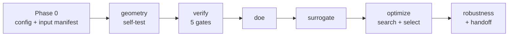

# Objective 2 Rajasthan: Fix Plan

Version 2, 2026-09-20 (re-reviewed after you pulled the repo). Version 1 was written the same day, before the pull.

## What changed since version 1

Rajasthan is unchanged: every source, config and results file I compared is byte-identical to what I reviewed before, so every Rajasthan finding and line number below still holds. (Two files I had not read before, `results/phase6_surrogate_error_by_group.csv` and `data/pcm/rajasthan_overheat_track_candidates.csv`, are new to me, not new on disk.)

Tamil Nadu changed a lot, and four of its changes alter the plan.

| Tamil Nadu change | Effect on this plan |
| --- | --- |
| `docs_objective2/18_OBJECTIVE1_SHORTLIST_RESTORED.md` (2026-09-18): Tamil Nadu stopped using Tm re-targeting and MCDM re-ranking to choose PCMs, restored Objective 1's shortlist and Tm 67 °C, and kept `retarget_tm.py` only as a diagnostic. | Step 4 is reversed. Version 1 said to make re-targeting the default. Now it is a reported diagnostic, and Rajasthan's Objective 1 shortlist stays the search space (which is what Rajasthan's 2026-09-18 re-sync already does). Decision D2 changes. |
| `docs_objective2/15_MCDM_RERANKING_AND_SAFETY_TIEBREAK.md` and `select_deployable.py`: `meets_temperature_safety` is now the first tie-break. Doc 18 also admits the pump-energy tie-break decides on differences near 1e-7 kWh. | Step 3 now has Tamil Nadu code to copy, and the same noise problem is confirmed in Rajasthan. Decision D3 changes. |
| `docs_objective2/17_ARRANGEMENT_RESTORATION.md` and `geometry.py`: Tamil Nadu found its arrangements gave identical hydraulics, fixed it with per-pattern unit-cell porosity, and now reports radial capped at 11.3% reachable PCM fraction against 19.8% for the others. | Rajasthan shows the same symptom (details in step 3). New item. |
| `configs/design_bounds_shared.yaml` is now `config_v2.0_2026-09-17` in Tamil Nadu, with `capsule_arrangement` as a dict (`type`, `allowed`, `default`). Rajasthan is still `config_v1.0_2026-09-05` with a plain list. | The "shared, frozen" file now differs between the two states in version and schema. Decision D4 and step 1 change. |

Two more things in the pulled Tamil Nadu tree, so you do not copy them into Rajasthan:

- Tamil Nadu's `config.py` points `OBJ1_ROOT` back at a non-existent `tamilnadu_pipeline` folder. Rajasthan's `config.py` has the 2026-09-13 fix.
- Tamil Nadu's `src/surrogate/features.py` again lists old climate column names, so only 3 of its climate features reach the model (`results/tamilnadu/surrogate/feature_cols.json` shows `monsoon_index`, `Tm_target_C`, `L_required_kJ_per_kg`), and it reads old `monte_carlo_stability.csv` column names. Rajasthan's version is the fixed one.

These look like 2026-09-13 fixes that the pull overwrote in Tamil Nadu. `git status` and `git log` in that folder will tell you. There is also a stray `results/--state/` folder in Tamil Nadu.

## Goal and scope

This plan makes `objective2-rajasthan` reproducible and its winning designs defensible, in eight ordered steps, using Tamil Nadu (`objective2-tamilnadu`) and the PCM `docs` folder as the reference. Steps 1 to 5 fix bugs that change results; step 6 ports missing Tamil Nadu features; steps 7 and 8 re-run and document.

Ground rules:

- Leave alone what already works: arrangement as a searched variable, d/2 derived thickness, the safety shield as pipeline default, the PCM-only selection pool, the 5% Pareto tolerance, the >15% surrogate-error rule, and Objective 1's shortlist as the search space.
- Every change to `design_bounds_shared.yaml` or `system_config_shared.yaml` must be mirrored in Tamil Nadu, Assam and Uttarakhand, or declared as a Rajasthan-only divergence in `docs/09_LIMITATIONS_AND_KNOWN_DIVERGENCES.md`.
- Any change to seeding, selection, DOE or geometry invalidates Phases 5 to 8. Do all code changes first, then one clean re-run (step 7), not a re-run per step.
- Work on a branch and commit per step, so each fix can be reverted alone.

## Decisions needed before work starts

Four choices change what the code does, so settle them first; my default is in the last column.

| # | Decision | Options | Default |
| --- | --- | --- | --- |
| D1 | Minimum PCM volume fraction (step 3) | Hard floor (e.g. 2%), soft flag only, or no floor | Hard floor; value set from a sweep in step 3 |
| D2 | Tm target policy (step 4) | Keep Objective 1's shortlist and Tm 67 °C as the search space and report re-targeting as a diagnostic, or switch the search space to re-targeted PCMs | Keep Objective 1's shortlist; report the diagnostic (Tamil Nadu doc 18 reached the same conclusion) |
| D3 | Tie-break among designs within 5% of best energy (step 3) | Pump energy first (today), safety margin first (Tamil Nadu now), or safety margin then useful energy | Safety margin first, then useful energy, then PCM mass, then capsule count |
| D4 | Shared-config changes (steps 1 and 6) | Adopt Tamil Nadu's `config_v2.0` bounds file in Rajasthan and propagate to Assam and Uttarakhand, or declare a Rajasthan-only divergence | Adopt v2.0 in Rajasthan now (small code change: read `bounds["capsule_arrangement"]["allowed"]`), then propagate |

A fifth, smaller call: the Objective 3 reward weights (step 6). Tamil Nadu ships a "fully specified" reward with default weights; Rajasthan's contract says weights are "NOT YET CHOSEN". Either adopt Tamil Nadu's defaults or leave them blank and say so in the contract.

## Step 1: Reproducibility

Today two seeds depend on Python's per-process `hash()`, so the DOE and the search give different results on every run. Fix the seeds, then pin the configs and inputs so a run can prove what it used.

1. In `src/doe/generate_cases.py`, add `_stable_hash(s) = zlib.crc32(s.encode()) & 0xFFFFFFFF` (copy from Tamil Nadu) and change line 156 to `seed = RANDOM_SEED + cid * 1000 + _stable_hash(pcm_id) % 1000`.
2. In `src/optimize/search.py`, import `_stable_hash` from `generate_cases` and change line 79 to use `_stable_hash(pcm_id) % 997`.
3. Add a test that runs the DOE and the search twice in separate processes and asserts identical case tables and identical top-N lists.
4. Bump `system_config_shared.yaml` (it gained the `safety_shield` block without a version change; it still reads `config_v1.0_2026-09-05`) and adopt Tamil Nadu's `design_bounds_shared.yaml` v2.0 (decision D4). Update `src/doe/generate_cases.py`, `src/optimize/search.py`, `src/design/constraints.py` and `src/verify/gates.py` to read `bounds["capsule_arrangement"]["allowed"]`.
5. Write a sha256 of both shared configs and the state config into every results file header.
6. `data/objective1/manifest.json` is stale: it is version 1.0.0, lists 69 files, and records the pre-re-sync hashes (for example `cluster_profiles_rajasthan.csv` is 2554 bytes with a different sha256 from the file on disk now). Port Tamil Nadu's `build_input_package.py` (Rajasthan does not have it) and regenerate the manifest, so the "frozen" claim becomes true.
7. Commit the `safety_shield` block and its default. Your docs record it was lost once; a tag on the commit protects it.

Exit check: two clean runs from scratch produce byte-identical `phase5_design_cases.csv` and `phase7_deployable_design_per_regime.csv`, and the manifest hashes match the files on disk.

## Step 2: Stale gates, labels and plots

The gates verify the simulator, so a gate that compares unlike cases can pass or fail for the wrong reason. Fix the comparisons and the text that describes them.

| File | Line(s) | Problem | Fix |
| --- | --- | --- | --- |
| `src/verify/gates.py` | 25–26, 50, 138–144 | Old "RT50" / "savE OM50" labels in the docstring, comment and case names | Use the current rank-1 names via `PCM_C0/1/2` |
| `src/verify/gates.py` | 142 | Case E uses n=24 | Use the same n as the design being verified |
| `src/verify/gates.py` | 365, 379 | Capability and no-loss checks use n=24 while the `fixed` case uses n=37 | Use one n for both sides of each comparison |
| `src/verify/gates.py` | 387 | Hard-coded "12.9%" in text | Compute from the run and print the value |
| `src/plots/make_plots.py` | 185, 205–210 | n=24 and "~12.9%" | Same as above |
| `pipeline.py` | 27 | Docstring example with RT50 and count 24 | Replace with a current example |

Also re-run `results/phase0_climate_signature_check.txt` (it still shows RJP_0202 / RJP_0055 and Tm 57) and regenerate `results/phase4_simulator_verification_report.txt`, whose shield confirmation used the previous Phase 7 winners.

Exit check: `grep -rn "RT50\|OM50\|12.9\|n=24" src pipeline.py` returns nothing outside comments that explain history, and all five gates pass on the regenerated report.

## Step 3: Selection rule, PCM loading and arrangement

The current winners hold 0.6 to 0.9% PCM by volume (Tamil Nadu's hold 1.0 to 2.3%) and beat the plain tank by 0.004 to 0.06%. Three separate problems sit behind that.

**Tie-break.** `select_deployable.py` sorts by pump energy, then PCM mass, then capsule count, then margin. Pump energy is about 1e-7 kWh here (Phase 6 pump MAE is 9e-9), so the first key decides on noise.

1. Change the sort to Tamil Nadu's order plus one change: `meets_temperature_safety` (descending), then useful energy (descending), then PCM mass, then capsule count, then `constraint_margin_C`. Apply decision D3. Tamil Nadu's doc 18 raises "useful energy before pump energy" as an open question; this settles it.
2. Carry `delivery_temp_hours` and `mains_temp_C` through `confirm_candidates` so the delivery requirement can be reported and, if you want, filtered on.
3. `run_phase7`: raise `top_n_per_pair` from 5 to at least 15 and add a per-arrangement quota, so each arrangement reaches the simulator confirmation step rather than one dominating the surrogate ranking.

**PCM loading.**

4. `src/design/geometry.py` (lines 317–322): decision D1. The 10% minimum in `pcm_volume_fraction` is only a soft `below_min_pcm_fraction` flag, and every winner is far below it. If a floor is chosen, turn the flag into a rejection reason so DOE, search and selection all respect it.
5. Before fixing the floor value, run a loading sweep on the three regime medoids (capsule fraction from 0.5% to 20%) with matched-Tm PCMs. My probe showed low loading gains 0.075–0.13% and 19.8% loading loses 0.03–0.78% for every PCM, so the useful range is narrow and the floor should come from this sweep, not a guess.

**Arrangement is close to a label in Rajasthan.**

6. Evidence from your own results: at d=0.05, n=14 the three arrangements have void fractions 0.7802 / 0.7779 / 0.7808 and pressure drops of about 2.0e-4 Pa (`results/phase2_geometry_boundary_selftest.txt`); the max reachable PCM fraction is 0.1984 for all three; surrogate importance for the arrangement columns is about 1e-6 (`results/phase6_arrangement_importance.csv`). Tamil Nadu found the same symptom and fixed it by computing `void_fraction` from each pattern's unit-cell porosity (`_pattern_void_fraction` in its `geometry.py`), which gives, for example, 0.476 for the square grid.
7. Port that model (or decide Rajasthan's bed-volume definition is right and add a cross-arrangement test with a stated threshold). Either way, keep the honest conclusion in the cards: `run_case.py` only passes arrangement through and never branches the physics, so arrangement can only matter through hydraulics, which are negligible here. Say so instead of implying arrangement was optimised.
8. Fix the rationale text in `_arrangement_rationale` (lines 93–117 of `select_deployable.py`). It compares the signed margin to the noise band, so a winner that is 0.06% below another arrangement (band 0.02%) is reported as "tied within noise". Tamil Nadu uses `abs(margin_pct)`. Also print the gap in kWh next to the percentage.

Exit check: the selected design in each regime is unchanged across three different search seeds, or the card states that it is not and lists the tied set; the cross-arrangement test passes or the cards say arrangement is not decisive.

## Step 4: Tm mismatch, reported rather than adopted

Rajasthan targets Tm = 67 °C in all three regimes, but median charging-hour tank water in a reference simulation is 43.5, 47.9 and 45.7 °C, so mean melt fraction of the winners is only 0.07–0.09. Tamil Nadu's answer (doc 18) is that this is a finding about Objective 1's target formula, not a reason for Objective 2 to choose different PCMs, because Objective 2 is asked for capsule thickness, arrangement, count and flow rate. Rajasthan's 2026-09-18 re-sync already follows that rule. This step therefore produces a diagnostic only.

1. Port `src/design/retarget_tm.py` from Tamil Nadu. Its current version already reads the c1–c8 string columns (`c2_absolute_band`, `c3_latent_heat`, `c4_cycling`, `c5_supercooling`, `survives_c7_corrosion`, `survives_c8_safety`), which is what Rajasthan's Objective 1 file uses, so it needs far less adaptation than version 1 of this plan said. Point it at Rajasthan's `feasibility_survivors_by_cluster.csv` (Tamil Nadu reads a `_kappa_calibrated` file that Rajasthan's `data/objective1/` does not contain; decide whether to copy it from Objective 1).
2. Method: simulate the reference plain tank (0.05 m / 16 / 0.030, staggered), take the median `T_w_C` over hours where `Q_collector_Wh > 0`; window [target − 5, target + 8] °C, ranked by |Tm − target|.
3. Write `results/tm_retargeting_report.csv` and have the Phase 8 cards state the mismatch next to the Objective 1 value. Do not change `pcm_shortlist` or `Tm_target_C` in `rajasthan.yaml`.
4. Probe shortlists for sanity-checking, indicative only: regime 0 Tm 55.2 / 55.0 / 54.6 °C; regime 1 Tm 61.0 / 59.8 / 59.0 °C; regime 2 Tm 59.0 / 58.0 / 58.0 °C.
5. Leave the MCDM re-ranking (`mcdm_reranking.py`) out; Tamil Nadu itself no longer runs it.

Exit check: the report exists, the cards state the gap between the 67 °C target and the simulated operating temperature, and the search space is still Objective 1's shortlist.

## Step 5: DOE coverage

The DOE produced 219 cases, only 126 valid, and every invalid case is a `bounds_violation`. In my count, 54 of the 108 boundary cases were minimum-diameter corners that cannot be built, so half the boundary budget teaches the surrogate nothing. Tamil Nadu's DOE has the same shape (219 cases, 107 valid), so do not copy it. The consolidated plan's checklist also asks for per-arrangement coverage.

1. `src/doe/generate_cases.py`: generate boundary cases from the feasible region (clip each corner to the geometry limits, or drop corners that violate them before counting), not from the raw box.
2. Stratify by arrangement and regime and print a coverage table (valid cases per arrangement × regime × PCM). Set a minimum per cell, e.g. 25 valid cases.
3. Size the DOE from that minimum, not from a fixed total; expect roughly 2 to 3 times the current valid count.
4. `src/surrogate/features.py`: `Tm_target_C` is a constant (67) across all regimes and carries no information; replace it with `Tm_target_capped_C` and add `wind_sunset_mean`. Both columns exist in `cluster_profiles_rajasthan.csv`, so nothing is silently dropped today; this is a relevance fix.
5. Add boundary tests to the acceptance checklist: at least one valid case at each edge of diameter, count and flow rate for each arrangement.

Exit check: the coverage table has no empty cell, and the surrogate's >15% error rule is evaluated per arrangement, not only overall.

## Step 6: Ports from Tamil Nadu

These add capability rather than fix bugs. Do the first two before handing off to Objective 3; the rest are optional.

| Priority | Feature | Tamil Nadu source | Rajasthan work | Blocker |
| --- | --- | --- | --- | --- |
| 1 | Reward-function spec and guard band | `src/handoff/build_obj3_contract.py` (`GUARD_BAND_C = 3.0`, `_reward_function_spec`, status "FULLY SPECIFIED") | Add to Rajasthan's `build_obj3_contract.py` (it has the guard band but not the reward spec); replace "NOT YET CHOSEN" in `obj3_environment_contract_rajasthan.json` | Decision on weights |
| 2 | Historical weather ensemble for robustness | `src/robustness/weather_ensemble.py`, used by Tamil Nadu's `monte_carlo.py` (10 real years, 2016–2025) | Replace the synthetic ±7% GHI / ±1.5 °C draws in `src/robustness/monte_carlo.py`; keep synthetic as a secondary check | Needs `daily_aggregates_rajasthan.csv`, which your manifest lists as hashed-not-copied; it lives in the Objective 1 `era5-rajasthan` folder, which is not connected |
| 3 | Input package and manifest | `build_input_package.py`, `build_demand_profile.py` | Port the first (step 1 item 6); port the second only if Rajasthan's demand file is hand-built | None |
| 4 | Run documentation | `docs_objective2/HOW_TO_RUN.md`, `REFERENCES.md` | Write Rajasthan's equivalents (see step 8) | None |
| 5 | Multi-fidelity surrogate | `src/surrogate/multifidelity.py`, `pipeline.py --stage multifidelity` | Only if step 5 still leaves surrogate error above 15% | Depends on step 5 result |

Correction to version 1: Tamil Nadu no longer has a `run_all_tamilnadu.py`. Both states run through `pipeline.py --stage <name>`, and Rajasthan's `pipeline.py` already has the same stages, so there is no orchestrator to port.

The weather ensemble matters most scientifically: Phase 8 currently reports P(meets demand) = 0.917 in regime 0 and 1.0 elsewhere on synthetic noise only, which understates year-to-year variation.

## Step 7: Re-run and verify

Run once, after steps 1 to 6 are merged, from a clean `results/` directory. Order matters because each phase reads the previous one's output.

Stop at any stage whose exit check fails; do not carry on to the next one.

Acceptance checklist, drawn from the consolidated plan and this review:

- [ ] Two clean runs in separate processes give identical outputs (step 1).
- [ ] Manifest hashes match the Objective 1 files on disk (step 1).
- [ ] All five gates pass, with like-for-like cases and no stale labels (step 2).
- [ ] Selected designs are stable across three search seeds, or ties are reported (step 3).
- [ ] The cards say whether arrangement is decisive, with the gap in kWh and %, and the cross-arrangement test passes (step 3).
- [ ] The Tm diagnostic is reported next to the Objective 1 value and the search space is unchanged (step 4).
- [ ] DOE coverage has no empty arrangement × regime cell, and boundary tests pass (step 5).
- [ ] Winners are checked for temperature safety with the shield on and with it off, and both results are reported: nominal safety is the property of the design, the shield is a backstop. (Tamil Nadu, which has no shield, reports P(temperature-safe) of 0.0 to 0.19 for its Objective 1 shortlist; Rajasthan's shielded 1.0 is not comparable.)
- [ ] The simulator, not the surrogate, is the final authority for every reported number, and any case where surrogate and simulator differ by more than 15% is flagged.
- [ ] The Objective 3 contract JSON has no "NOT YET CHOSEN" fields, and its config hashes match the files used.

If a winner still shows less than 1% gain over the plain tank after the re-run, report that as the finding: PCM adds little for that regime under these bounds. Do not tune until it looks better.

## Step 8: Docs refresh, risks and effort

Document after the re-run, so every number in the text comes from the final results.

1. `README.md` and `results/README.md`: replace the stale headline (RT45HC / PCM6 / PCM3, "0.07–0.14%", `sim_v1`) with the new winners and gains, and remove the "byte-identical" and "frozen" claims unless step 1's test and manifest back them.
2. `docs/09_LIMITATIONS_AND_KNOWN_DIVERGENCES.md`: rewrite the tables its own text flags as stale, and fix §5 so it matches the yaml bounds (count max 37, arrangement enum present). Add the Tm diagnostic, the arrangement finding and any config divergence (decision D4) as new divergences.
3. `docs/00_MASTER_CHANGE_PLAN.md` and the phase docs: add a dated note that this fix plan superseded the numbers quoted there.
4. Add `HOW_TO_RUN.md` and `REFERENCES.md` (Tamil Nadu has both; its `RESULTS.md` has moved to `docs_objective2/archive/`, so a Rajasthan `RESULTS.md` is optional).
5. Objective 1 side: Rajasthan's O1 readiness report still quotes old Spearman values and a "missing" PCM file, and cluster 0 rests on only 4 candidates. Where O2 cards say "DIVERGES from O1 rank-1", cite the current O1 numbers and state the n=4 caveat.

| Risk | Effect | Mitigation |
| --- | --- | --- |
| Porting the unit-cell porosity model changes which arrangements are feasible | Reachable-fraction table and DOE coverage change; winners may move | Do it before the DOE step, and keep old results in a dated archive folder |
| Loading floor leaves few valid designs | Smaller feasible set, higher rejection rate | Choose the floor from the step 3 sweep and report rejection counts |
| Weather ensemble data missing | Step 6 item 2 blocked | Ship with synthetic draws and label robustness as synthetic-only |
| Shared-config edits diverge across states | Cross-state comparisons become invalid | Adopt v2.0 (D4) and mark cross-state tables as stale until all four re-run |
| Copying from Tamil Nadu's pulled tree | Reintroduces its regressions (`OBJ1_ROOT`, climate column names) | Copy only the files named in this plan and diff them against Rajasthan's current versions |

Rough effort, for one person: step 1 about one to one and a half days; step 2 about one day; step 3 about two to three days; step 4 about one day (diagnostic only, down from two); step 5 about one to two days; step 6 about two to three days; step 7 about one day plus compute time; step 8 about one day. Total about 10 to 13 working days, with step 6 the easiest to defer.
